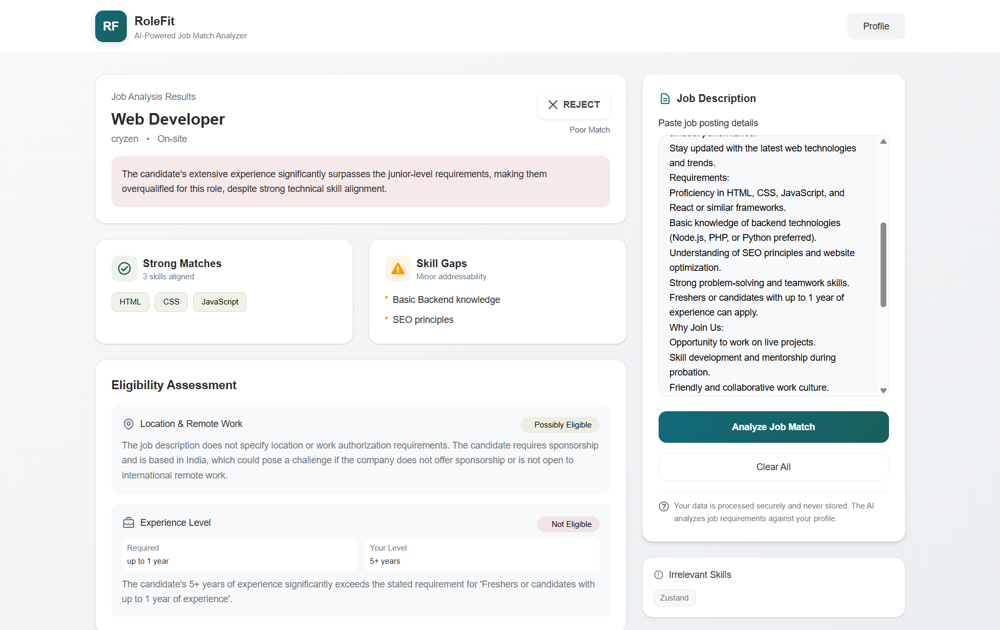

# RoleFit

RoleFit is a frontend-first web application that helps developers evaluate whether a job role is worth applying to before spending time on it.

The idea is to reduce wasted applications by analyzing a job description against a user’s profile and highlighting potential mismatches such as skill gaps, experience expectations, and location or eligibility concerns.

Live demo: https://role-fit.vercel.app  
Repository: https://github.com/rahman-D3V/RoleFit

---

## Overview

Applying to multiple jobs often becomes overwhelming, especially for remote roles where job descriptions can be unclear or misleading.  
RoleFit explores how developers can make more informed decisions by reviewing job requirements before applying.

Users create a profile, paste a job description, and receive an AI-assisted analysis that surfaces signals such as:
- Skill alignment
- Missing or irrelevant skills
- Experience expectations
- Location or eligibility red flags

The goal is **decision support**, not guaranteed accuracy or hiring outcomes.

---

## Screenshot

---

## Key Features

### Authentication & User Flow (Frontend-simulated)
- Sign up and sign in flow
- Guest login using demo credentials
- Client-side authentication state using Zustand
- Protected routes for profile and JD analyzer pages
- Simulated loaders for login and logout to mimic real-world UX

### Profile Management
- Profile page to collect user details
- Form validation using React Hook Form
- Profile summary view for reviewing saved data
- Client-side persistence of profile information

### Job Description Analyzer
- Dedicated JD analyzer page
- Compare user profile with pasted job descriptions
- AI-assisted analysis using Google Gemini
- Highlights skill match, gaps, and potential mismatches
- Results generated through a server API route

### UX & Structure
- Clean landing page with clear flow
- Improved navigation structure
- Smooth transitions between auth, profile, and analyzer
- Responsive layout and UI refinements
- Incremental refactors to improve readability and structure

---

## Tech Stack

- **Next.js (App Router)**
- **React.js**
- **Tailwind CSS**
- **Google Gemini API** for analysis
- **Zustand** for state management
- **React Hook Form** for form handling and validation
- **React Icons**
- **Vercel** for deployment

---

## Scope & Limitations

- This is primarily a **frontend-focused project**
- Authentication and user data are simulated on the client
- Job analysis is based solely on user-provided input
- No live job board integrations
- AI-generated results are advisory and not definitive
- Accuracy depends on the clarity of the job description and profile data

This project is intended to demonstrate frontend architecture, user flow design, and AI API integration rather than act as a production hiring tool.

---

## What This Project Demonstrates

- Building structured user flows in a modern Next.js app
- Managing client-side auth and protected routes
- Integrating AI APIs through server routes
- Handling complex forms and validation
- Incremental development with meaningful commits
- Designing realistic UX for real-world scenarios

---

## Author

Habibur Rahman  
Portfolio: https://rahmanjs.in
